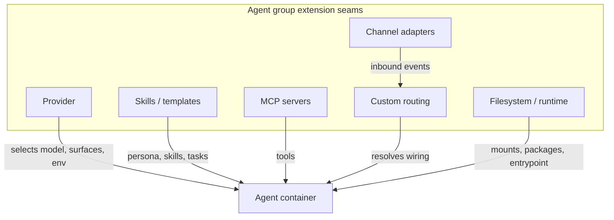
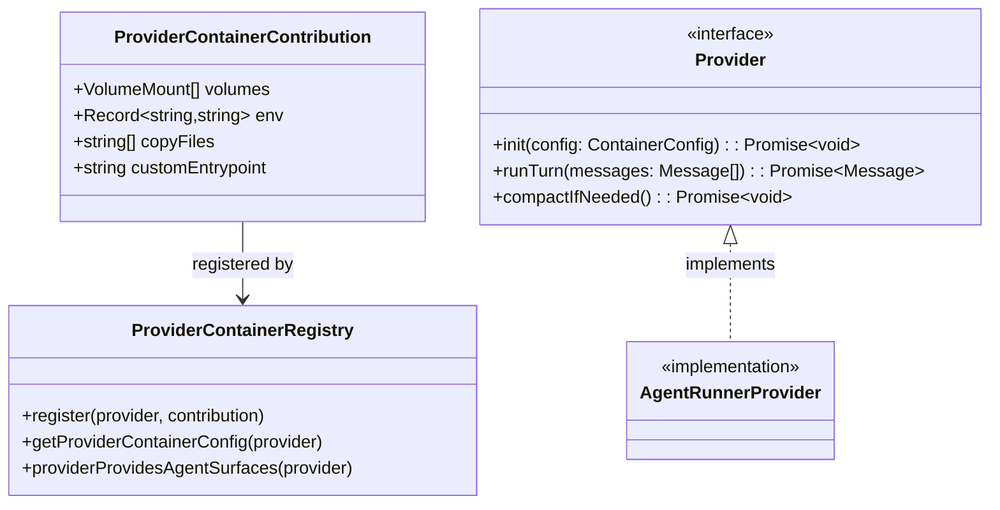
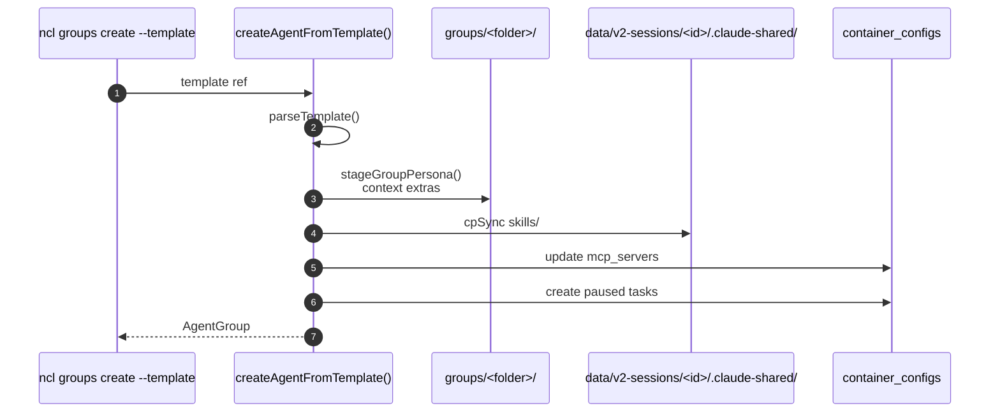
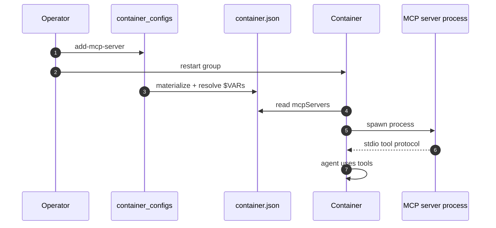

# Extending Agent Groups

Agent groups are the main extension surface in NanoClaw. This document describes the stable seams for changing what an agent group can do, how it runs, and how it talks to channels. It covers provider extensions, skill/template extensions, MCP server extensions, channel/routing extensions, filesystem/runtime extensions, and the migration conventions that keep extensions composable.

For the conceptual model and day-to-day operations of agent groups, see [agent-groups.md](agent-groups.md).

---

## 1. Extension seams overview



| Seam                 | What you extend                               | Typical touch points                                                                        |
| -------------------- | --------------------------------------------- | ------------------------------------------------------------------------------------------- |
| Provider             | Which LLM/planner runs the agent              | `src/providers/`, `container/agent-runner/src/providers/`, `provider-container-registry.ts` |
| Skills / templates   | Per-group behavior and knowledge              | `.claude/skills/`, `src/templates/`, `container/skills/`, `src/group-skills.ts`             |
| MCP servers          | Tools available inside the container          | `container_configs.mcp_servers`, `container/skills/<name>/`                                 |
| Channel adapters     | New messaging platforms                       | `src/channels/`, `src/channels/channel-registry.ts`, `src/channels/channel-defaults.ts`     |
| Custom routing       | Multi-agent fan-out or content-based dispatch | `src/router.ts` hooks, custom channel adapter logic                                         |
| Filesystem / runtime | Host paths, packages, image, entrypoint       | `container_configs.additional_mounts`, `packages_*`, `image_tag`, `custom_entrypoint`       |

---

## 2. Provider extension

A **provider** is the LLM or agent framework that the container invokes to plan and execute turns. NanoClaw ships with provider abstraction code in trunk; real provider implementations live on the `providers` branch and are installed per-fork via skills like `/add-opencode` or `/add-codex`.

### 2.1 What a provider extension must provide

| Component              | Location                                         | Responsibility                                                                                                      |
| ---------------------- | ------------------------------------------------ | ------------------------------------------------------------------------------------------------------------------- |
| Host-side registration | `src/providers/<name>.ts`                        | Registers container contributions (mounts, env, entrypoint) and declares whether it provides its own agent surfaces |
| Agent-runner provider  | `container/agent-runner/src/providers/<name>.ts` | Reads `container.json`, initializes the client, implements the poll/reply loop                                      |
| Container setup        | `container/agent-runner/` package                | Adds any runtime deps the provider needs                                                                            |

### 2.2 Host-side registry

`src/providers/provider-container-registry.ts` exposes two key functions:

```typescript
export function registerProviderContainerConfig(provider: string, contribution: ProviderContainerContribution): void;

export function providerProvidesAgentSurfaces(provider: string): boolean;
```

A provider calls `registerProviderContainerConfig()` at import time to add:

- extra volume mounts
- environment variables
- a custom entrypoint
- host files to copy into the container

If the provider brings its own agent surfaces (Codex, OpenCode, etc.), it returns `true` from `providerProvidesAgentSurfaces()`. This tells `initGroupFilesystem()` **not** to create the `.claude-shared/` settings directory, because the provider manages its own per-group config store.

### 2.3 Provider class diagram



### 2.4 Default surfaces

If a provider does **not** declare its own surfaces, the agent runner uses the default surfaces. The default path expects:

- `data/v2-sessions/<agent_group_id>/.claude-shared/settings.json`
- `data/v2-sessions/<agent_group_id>/.claude-shared/skills/`

These are created by `initGroupFilesystem()` in `src/group-init.ts`.

---

## 3. Skill and template extension

Skills are the primary way to change an agent group's behavior without touching core code.

### 3.1 Skill flavors

| Flavor                 | Where it lives                            | Loaded by                   | Scope                                   |
| ---------------------- | ----------------------------------------- | --------------------------- | --------------------------------------- |
| Host operational skill | `.claude/skills/<name>/SKILL.md`          | Operator / opencode         | Host-side workflows                     |
| Host utility skill     | `.claude/skills/<name>/` with code files  | Operator / opencode         | Host-side code changes                  |
| Template skill         | `src/templates/<template>/skills/<name>/` | `createAgentFromTemplate()` | Stamped into one agent group            |
| Container skill        | `container/skills/<name>/`                | Agent container             | Tools/instructions inside the container |

### 3.2 Template skills

When an agent group is created from a template (`ncl groups create --template <ref>`), `createAgentFromTemplate()` in `src/templates/create-agent.ts`:

1. Stamps the template persona into `groups/<folder>/instructions.prepend.md`.
2. Copies template context extras into `groups/<folder>/`.
3. Copies template skills as real directories into `data/v2-sessions/<agent_group_id>/.claude-shared/skills/`.
4. Adds template MCP servers to `container_configs.mcp_servers`.
5. Creates paused scheduled tasks from the template.



### 3.3 Provider-neutral vs provider-specific skills

- **Provider-neutral** skills are copied into `.claude-shared/skills/` and read directly by Claude.
- **Other providers** (Codex, OpenCode, etc.) read from their own per-group skills directories. `materializeTemplateSkills()` in `src/group-skills.ts` copies template skills from `.claude-shared/skills/` into the provider's directory at spawn time, unless the provider reads `.claude-shared/` directly.

This is the single shared seam; adding a new provider that needs its own skills directory means adding one call to `materializeTemplateSkills()` in that provider's host-side contribution.

### 3.4 Container skills

Container skills live in `container/skills/<name>/` and are loaded inside the agent container. They are typically MCP servers or provider-specific instruction packs. To enable a container skill for a group, add it to `container_configs.skills` (or `skills: 'all'`) and ensure the skill directory is copied/symlinked into the container image by the container build or provider contribution.

---

## 4. MCP server extension

MCP servers extend the agent's tool set. They are configured per group in `container_configs.mcp_servers` and started by the agent runner inside the container.

### 4.1 Adding an MCP server

```bash
ncl groups config add-mcp-server \
  --id <agent-group-id> \
  --name obsidian \
  --command npx \
  --args '["-y","@nanoco/mcp-obsidian"]' \
  --env '{"OBSIDIAN_VAULT":"/workspace/vault"}'
```

This writes into `container_configs.mcp_servers` as JSON. On the next `ncl groups restart`, `materializeContainerJson()` resolves `$VAR` references from `.env` and writes the literal config into `container.json`.

### 4.2 Secret handling

There are two ways to supply credentials:

1. **`.env` variable reference** — `{"API_KEY": "$MY_API_KEY"}`. The host resolves it at spawn time. The literal value appears in `container.json` inside the container, but is never committed to the DB in plain text.
2. **OneCLI credential injection** — the MCP server requests credentials from the OneCLI gateway at runtime. No secret is stored in `container.json`; the server uses a short-lived token. See `src/container-config.ts:resolveSecretRefs()` and the OneCLI docs.

### 4.3 MCP server lifecycle diagram



### 4.4 Container packages for MCP servers

If an MCP server needs system or npm packages, add them with:

```bash
ncl groups config add-package --id <id> --apt poppler-utils --npm pdf-parse
ncl groups restart --id <id> --rebuild
```

`--rebuild` is required because apt packages are baked into the image.

---

## 5. Channel and routing extension

Channels are how the outside world reaches agent groups. Trunk ships only the channel registry and Chat SDK bridge; real adapters live on the `channels` branch and are installed via `/add-<channel>` skills.

### 5.1 Channel adapter contract

A channel adapter lives in `src/channels/<channel>.ts` and implements the `ChannelAdapter` interface from `src/channels/adapter.ts`. The router cares about:

- `channelType` and `instance`
- `supportsThreads`
- `mentions` signal policy (`'platform' | 'dm-only' | 'never'`)
- `sendMessage()` / `sendDirectMessage()` for outbound delivery
- optionally `subscribe()` for mention-sticky threading

### 5.2 Channel defaults

Each adapter declares defaults for how it wires to agent groups:

```typescript
interface ChannelDefaults {
  dm: {
    engageMode: EngageMode;
    engagePattern?: string;
    senderScope: SenderScope;
    ignoredMessagePolicy: IgnoredMessagePolicy;
    threads: boolean | null;
  };
  group: {
    engageMode: EngageMode;
    engagePattern?: string;
    senderScope: SenderScope;
    ignoredMessagePolicy: IgnoredMessagePolicy;
    threads: boolean | null;
  };
  mentions: 'platform' | 'dm-only' | 'never';
}
```

These defaults are consulted at wiring creation time (`src/channels/channel-defaults.ts`). Existing wirings are never re-resolved; only new wirings inherit the current adapter declaration.

### 5.3 Custom routing

The router is intentionally simple: one message can fan out to multiple agent groups. If you need content-based routing (e.g., `@supervisor` goes to a different group than normal messages), you have two options:

1. **Adapter-level routing** — parse the message in the channel adapter and emit events with different `platformId`/`threadId` semantics, or route to different `messaging_groups` before the router sees them.
2. **Engage patterns** — wire multiple agent groups to the same channel with `engage_mode='pattern'` and disambiguating regexes.

For more complex patterns (manager agents that query worker sessions, supervisor duplication), see the "PR Factory" example in [architecture.md](architecture.md). Those patterns require custom host code; they are not base-architecture seams.

---

## 6. Filesystem and runtime extension

Beyond providers, skills, and MCP servers, you can extend the container environment itself.

### 6.1 Additional mounts

Host directories can be mounted into a group's containers:

```bash
ncl groups config add-mount --id <id> --host /Users/me/projects --container /workspace/projects --ro
```

Mount management is **operator-only** (`hostOnly: true`). The host path is validated against the mount allowlist by `src/modules/mount-security/index.ts`. Changes take effect on the next `ncl groups restart`.

### 6.2 Packages

Apt and npm packages are stored in `container_configs.packages_apt` and `container_configs.packages_npm`. They are installed during image build, so a rebuild is required.

### 6.3 Image and entrypoint

- `image_tag` overrides the container image for the group.
- `custom_entrypoint` replaces the default agent-runner entrypoint.

Both are advanced options; most forks should change the provider rather than the entrypoint.

### 6.4 Runtime config class diagram

```mermaid
classDiagram
    class ContainerConfig {
        +Record~string,McpServerConfig~ mcpServers
        +string[] skills
        +string provider
        +string model
        +string effort
        +string imageTag
        +string customEntrypoint
        +AdditionalMountConfig[] additionalMounts
        +packages: {apt: string[], npm: string[]}
    }

    class AdditionalMountConfig {
        +string hostPath
        +string containerPath
        +boolean readonly
    }

    class McpServerConfig {
        +string command
        +string[] args
        +Record~string,string~ env
        +string instructions
    }

    ContainerConfig --> AdditionalMountConfig
    ContainerConfig --> McpServerConfig
```

---

## 7. Migration conventions for extensions

Extensions that need new DB state should add a numbered migration file under `src/db/migrations/`. Core migrations use sequential numbers; skill/provider branches should use high numbers or timestamps to avoid collisions.

### 7.1 Migration file shape

```typescript
import type Database from 'better-sqlite3';

export function up(db: Database): void {
  db.exec(`
    CREATE TABLE IF NOT EXISTS my_extension_state (
      agent_group_id TEXT PRIMARY KEY REFERENCES agent_groups(id) ON DELETE CASCADE,
      value TEXT NOT NULL
    );
  `);
}
```

### 7.2 Rules

- Migrations are append-only. Never edit an existing migration file.
- New columns should have sensible defaults so existing rows remain valid.
- If an extension adds columns to a core table (e.g., `messaging_group_agents`), coordinate with trunk to reserve a migration number or use a high-numbered skill migration.
- Update `src/db/schema.ts` reference copy if you want the schema overview to stay accurate, but the migration file is the source of truth.

### 7.3 Backfill pattern

If an extension needs to populate state for pre-existing agent groups, add a one-time backfill script in `scripts/` (e.g., `scripts/backfill-container-configs.ts`). Run it manually after installing the extension; do not run heavy backfills automatically inside migrations.

---

## 8. What not to extend here

These patterns are powerful but are **not** stable agent-group seams:

- **Cross-group session queries** — an agent reading another group's `inbound.db`/`outbound.db`. Requires custom mounts and explicit security review.
- **Agent-initiated host mutations** — an agent inside a container asking the host to change wiring or config. Use MCP tools that emit `system` `messages_out` rows and have the host apply them with permission checks.
- **Direct container-to-host IPC** — everything must go through the two session DBs; do not add sockets, pipes, or file watchers.

For the base architecture building blocks that enable these patterns, see [architecture.md](architecture.md).

---

## 9. Related docs

- [agent-groups.md](agent-groups.md) — conceptual model, lifecycle, and operations.
- [skill-guidelines.md](skill-guidelines.md) — how to write skills.
- [architecture.md](architecture.md) — high-level design and PR Factory example.
- [db-central.md](db-central.md) — central DB schema and migration system.
