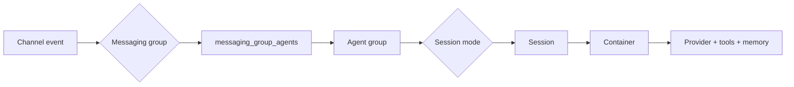
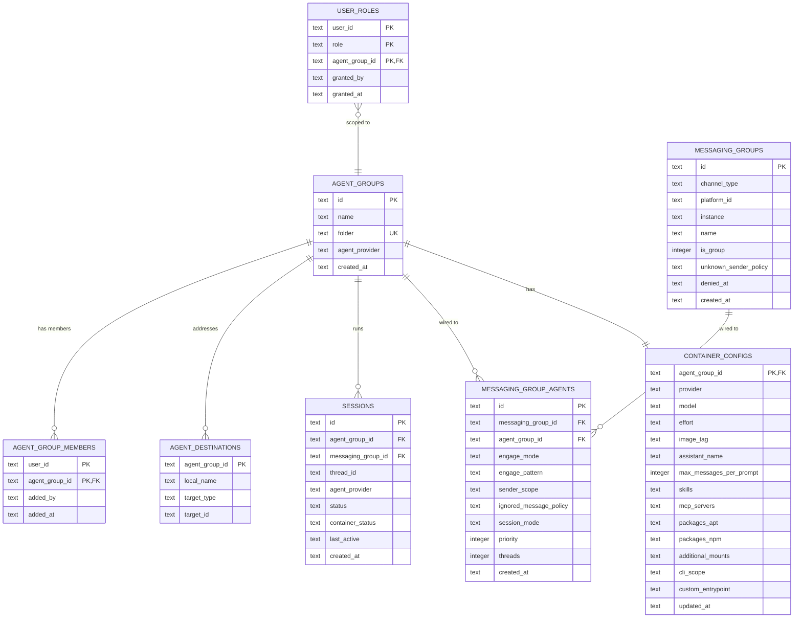
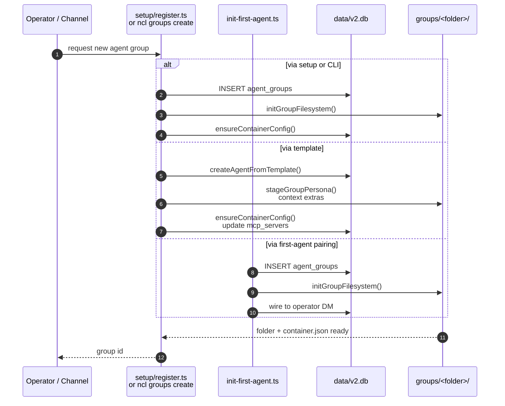
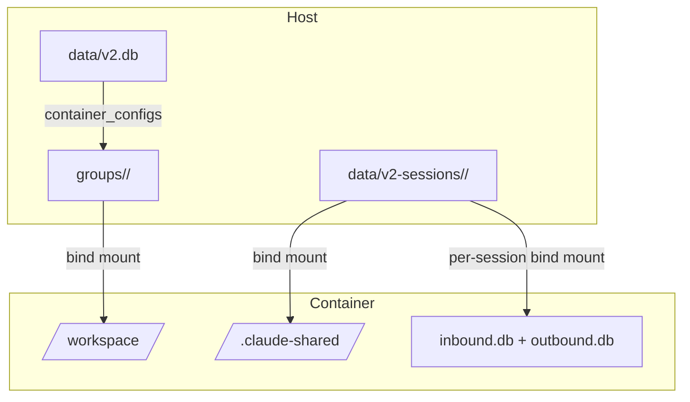
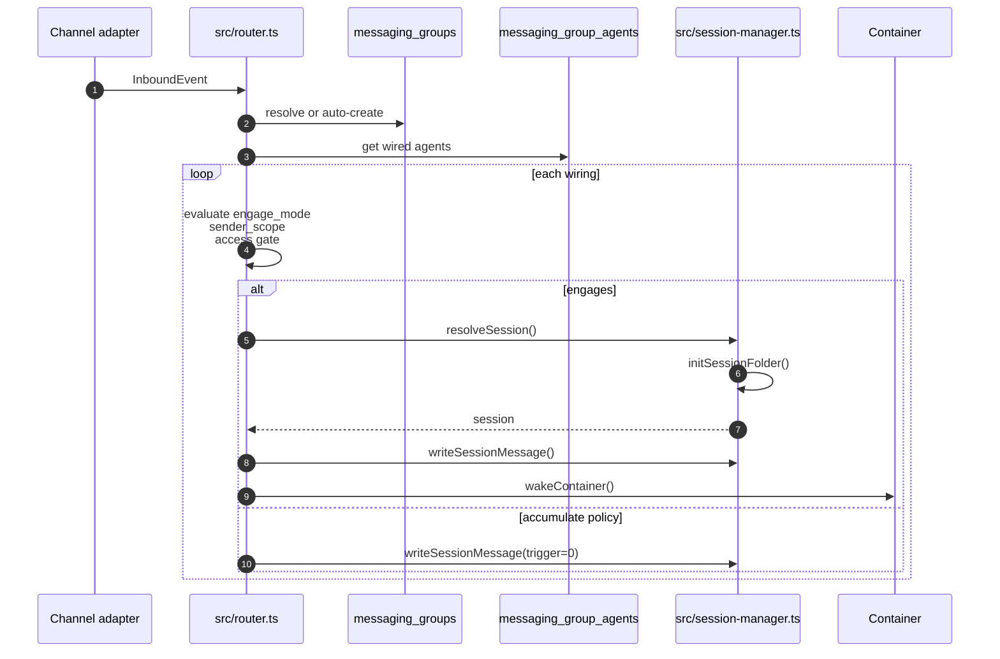
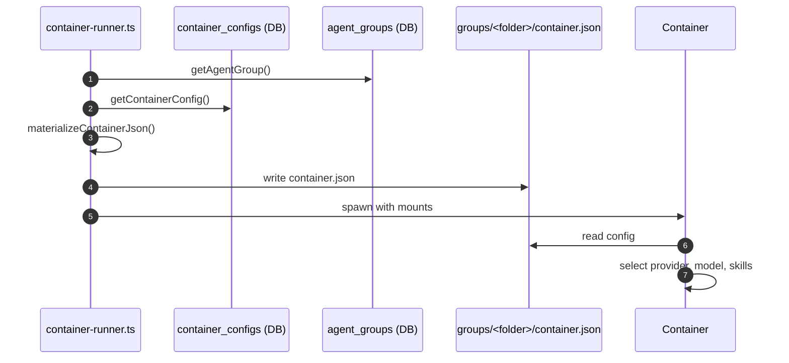

# Agent Groups

An **agent group** is the workspace-and-identity boundary for a NanoClaw agent. It is the unit that owns:

- a private working directory on the host (`groups/<folder>/`)
- per-group memory, skills, and standing instructions
- container runtime configuration (provider, model, MCP servers, packages, mounts)
- one or more runtime **sessions**, each backed by a pair of SQLite databases
- the access-control boundary for unprivileged members (`agent_group_members`)

Multiple **messaging groups** (channels, DMs, webhooks) can be wired to a single agent group. The wiring decides whether those channels share one conversation, keep independent conversations, or stay fully isolated. This document describes how agent groups are modeled, created, stored, routed, configured, and operated.

For the platform chat entity, see [docs/messaging-groups.md](messaging-groups.md). For the wiring layer that binds chats to agents, see [docs/messaging-group-agents.md](messaging-group-agents.md).

---

## 1. What an agent group is

Conceptually, an agent group is a **single agent identity**. If two channels are wired to the same agent group, the same memory, skills, and personality serve both. If they are wired to different agent groups, they are different agents with no shared state.

The host uses the agent group to answer three questions for every inbound message:

1. **Which agent identity should handle this?** — resolved from `messaging_group_agents`.
2. **Which session should it run in?** — resolved from `session_mode` and `(messaging_group_id, thread_id)`.
3. **How should the container be configured?** — resolved from `container_configs` and materialized to `groups/<folder>/container.json`.



The entity is intentionally separate from both the **channel** (`messaging_groups`) and the **runtime instance** (`sessions`). Channels come and go; sessions are created lazily; the agent group is the persistent identity that ties them together.

---

## 2. Entity model



| Entity                   | Purpose                                       | Lives in                                            |
| ------------------------ | --------------------------------------------- | --------------------------------------------------- |
| `agent_groups`           | Identity + folder mapping                     | `data/v2.db`                                        |
| `container_configs`      | Runtime config source of truth                | `data/v2.db`                                        |
| `messaging_group_agents` | Channel-to-agent wiring + engagement rules    | `data/v2.db`                                        |
| `sessions`               | Runtime instances                             | `data/v2.db` + `data/v2-sessions/<agent_group_id>/` |
| `agent_destinations`     | Named delivery targets inside the agent group | `data/v2.db`                                        |
| `agent_group_members`    | Unprivileged access gate                      | `data/v2.db`                                        |
| `user_roles`             | Owner/admin grants, optionally scoped         | `data/v2.db`                                        |

---

## 3. Lifecycle

### 3.1 Creation paths

An agent group can be created in several ways. All paths ultimately call `createAgentGroup()` in `src/db/agent-groups.ts` and then initialize the on-disk state.



| Path                | Entry point                                         | Notes                                           |
| ------------------- | --------------------------------------------------- | ----------------------------------------------- |
| CLI (bare)          | `ncl groups create --folder <slug> [--name <name>]` | `src/cli/resources/groups.ts`                   |
| CLI (template)      | `ncl groups create --template <ref>`                | `src/templates/create-agent.ts`                 |
| Setup wizard        | `setup/register.ts`                                 | Used during initial install                     |
| First-agent pairing | `scripts/init-first-agent.ts`                       | Creates the operator's DM agent                 |
| Channel approval    | `src/modules/permissions/channel-approval.ts`       | Auto-creates after owner approves a new channel |

`initGroupFilesystem()` (`src/group-init.ts`) is idempotent. It creates:

- `groups/<folder>/`
- `instructions.prepend.md` if instructions are provided and the file does not exist
- a `container_configs` row (via `ensureContainerConfig`)
- `data/v2-sessions/<id>/.claude-shared/` with `settings.json` and `skills/` for providers that use default agent surfaces

### 3.2 Folder naming

The folder name is validated by `src/group-folder.ts`:

- must match `^[A-Za-z0-9][A-Za-z0-9_-]{0,63}$`
- cannot contain path separators or `..`
- cannot be `global` (reserved)
- must be unique across all agent groups

The folder is immutable after creation. If `createAgentFromTemplate()` collides, it appends a short random suffix.

### 3.3 Update and delete

| Operation | CLI                                                           | Source                        |
| --------- | ------------------------------------------------------------- | ----------------------------- |
| Rename    | `ncl groups update --id <id> --name <new>`                    | `src/db/agent-groups.ts`      |
| Delete    | `ncl groups delete --id <id>`                                 | `src/cli/resources/groups.ts` |
| Restart   | `ncl groups restart --id <id> [--rebuild] [--message <text>]` | `src/container-restart.ts`    |

Deletion is a hand-written FK-ordered cascade because the generic single-table `DELETE` violates foreign-key constraints. It removes dependent rows in `sessions`, `messaging_group_agents`, `agent_group_members`, `user_roles`, `container_configs`, `agent_destinations`, and approval tables. It does **not** clean up `groups/<folder>/` or `data/v2-sessions/<id>/`; those are left for manual cleanup.

---

## 4. On-disk layout

Each agent group has two filesystem locations.

### 4.1 Group workspace: `groups/<folder>/`

This is the agent's persistent working directory. It is bind-mounted into the container at `/workspace` (or a provider-specific path).

```
groups/
  <folder>/
    CLAUDE.md                 ← composed per spawn from CLAUDE.local.md + persona prepend
    CLAUDE.local.md           ← operator-edited project instructions
    instructions.prepend.md   ← provider-neutral standing instructions (stamped once)
    container.json            ← materialized at spawn from container_configs
    ...                       ← context extras, notes, files the agent creates
```

- `instructions.prepend.md` is provider-neutral. It is inlined at the top of the composed provider project document on every spawn.
- `CLAUDE.local.md` is the operator-edited project doc for Claude-backed groups.
- `container.json` is overwritten at every spawn; do not edit it by hand.

### 4.2 Group-shared session state: `data/v2-sessions/<agent_group_id>/`

This directory holds state shared across every session of the agent group, plus per-session folders.

```
data/v2-sessions/
  <agent_group_id>/
    .claude-shared/
      settings.json           ← Claude-specific settings (memory, hooks)
      skills/                 ← real directories of per-group skills
    <session_id>/
      inbound.db              ← host writes, container reads
      outbound.db             ← container writes, host reads
      .heartbeat              ← container touches for liveness
      inbox/<message_id>/     ← decoded user attachments
      outbox/<message_id>/    ← attachments produced by the agent
```

The `.claude-shared/` directory is created by `initGroupFilesystem()` only for providers that rely on the default agent surfaces. Providers that bring their own surfaces (e.g., Codex, OpenCode) may use a different per-group path.

### 4.3 Layout diagram



---

## 5. Database representation

### 5.1 `agent_groups`

```sql
CREATE TABLE agent_groups (
  id               TEXT PRIMARY KEY,
  name             TEXT NOT NULL,
  folder           TEXT NOT NULL UNIQUE,
  agent_provider   TEXT,        -- deprecated; use container_configs.provider
  created_at       TEXT NOT NULL
);
```

| Column           | Meaning                                                                   |
| ---------------- | ------------------------------------------------------------------------- |
| `id`             | `ag-<uuid>` primary key                                                   |
| `name`           | Display name; not unique; used in logs and channel adapters               |
| `folder`         | On-disk directory name under `groups/`; immutable                         |
| `agent_provider` | Deprecated. Per-group provider now lives in `container_configs.provider`. |
| `created_at`     | ISO-8601 UTC timestamp                                                    |

Access layer: `src/db/agent-groups.ts`.

### 5.2 `container_configs`

One row per agent group. Source of truth for runtime configuration.

```sql
CREATE TABLE container_configs (
  agent_group_id          TEXT PRIMARY KEY REFERENCES agent_groups(id) ON DELETE CASCADE,
  provider                TEXT,
  model                   TEXT,
  effort                  TEXT,
  image_tag               TEXT,
  assistant_name          TEXT,
  max_messages_per_prompt INTEGER,
  skills                  TEXT NOT NULL,  -- JSON: "all" | ["skill1", "skill2"]
  mcp_servers             TEXT NOT NULL,  -- JSON: Record<string, McpServerConfig>
  packages_apt            TEXT NOT NULL,  -- JSON: string[]
  packages_npm            TEXT NOT NULL,  -- JSON: string[]
  additional_mounts       TEXT NOT NULL,  -- JSON: AdditionalMountConfig[]
  cli_scope               TEXT NOT NULL,  -- disabled | group | global
  custom_entrypoint       TEXT,
  updated_at              TEXT NOT NULL
);
```

Access layer: `src/db/container-configs.ts`. The row is created by `ensureContainerConfig()` (`src/db/container-configs.ts`) at group-creation time and materialized to `container.json` by `materializeContainerJson()` (`src/container-config.ts`) at every spawn.

### 5.3 `messaging_group_agents`

The wiring table. Many-to-many between channels and agent groups.

```sql
CREATE TABLE messaging_group_agents (
  id                     TEXT PRIMARY KEY,
  messaging_group_id     TEXT NOT NULL REFERENCES messaging_groups(id),
  agent_group_id         TEXT NOT NULL REFERENCES agent_groups(id),
  engage_mode            TEXT NOT NULL DEFAULT 'mention',   -- pattern | mention | mention-sticky
  engage_pattern         TEXT,                               -- regex; '.' = always
  sender_scope           TEXT NOT NULL DEFAULT 'all',       -- all | known
  ignored_message_policy TEXT NOT NULL DEFAULT 'drop',      -- drop | accumulate
  session_mode           TEXT DEFAULT 'shared',             -- shared | per-thread | agent-shared
  priority               INTEGER DEFAULT 0,
  threads                INTEGER,                           -- NULL = inherit adapter default
  created_at             TEXT NOT NULL,
  UNIQUE(messaging_group_id, agent_group_id)
);
```

Access layer: `src/db/messaging-groups.ts`.

### 5.4 `sessions`

Runtime instances of an agent group.

```sql
CREATE TABLE sessions (
  id                TEXT PRIMARY KEY,
  agent_group_id    TEXT NOT NULL REFERENCES agent_groups(id),
  messaging_group_id TEXT REFERENCES messaging_groups(id),
  thread_id         TEXT,
  agent_provider    TEXT,
  status            TEXT NOT NULL,       -- active | closed
  container_status  TEXT NOT NULL,       -- running | idle | stopped
  last_active       TEXT,
  created_at        TEXT NOT NULL
);
```

A session's folder path is `data/v2-sessions/<agent_group_id>/<session_id>/`. See [db-session.md](db-session.md) for the two-DB split.

---

## 6. Routing and sessions

### 6.1 Routing overview

For every inbound event, `routeInbound()` in `src/router.ts`:

1. Resolves the `messaging_groups` row (auto-creating on mention/DM if needed).
2. Fetches all `messaging_group_agents` wirings for that messaging group.
3. Resolves the sender via the permissions module's `senderResolver` hook.
4. For each wired agent, evaluates `engage_mode`, `sender_scope`, and the access gate.
5. Resolves or creates a `session` according to the wiring's `session_mode`.
6. Writes the message to the session's `inbound.db` and wakes the container.



### 6.2 Session modes

| Mode           | Behavior                                             | Use case                                                 |
| -------------- | ---------------------------------------------------- | -------------------------------------------------------- |
| `shared`       | One session per messaging group                      | Default; independent conversations per channel           |
| `per-thread`   | One session per `(messaging_group, thread)`          | Threaded channels (Discord, Slack, GitHub PRs)           |
| `agent-shared` | One session per agent group; ignores messaging group | Cross-channel shared conversation (e.g., GitHub + Slack) |

Resolution is implemented in `src/session-manager.ts:resolveSession()`.

### 6.3 Engage modes

| Mode             | Triggers when                                                                      | Notes                                                    |
| ---------------- | ---------------------------------------------------------------------------------- | -------------------------------------------------------- |
| `pattern`        | `engage_pattern` regex matches message text                                        | `'.'` matches every message                              |
| `mention`        | `event.message.isMention` is true                                                  | Platform mention/DM signal from adapter                  |
| `mention-sticky` | Mention OR an active session already exists for `(agent, messaging_group, thread)` | Follow-ups in a thread keep firing without a new mention |

Bad regexes in `pattern` mode fail open so an admin sees the agent respond and can fix the pattern.

### 6.4 Sender scope and ignored messages

- `sender_scope='all'` — any sender can engage the agent.
- `sender_scope='known'` — only `user_roles` holders or `agent_group_members` rows for this group can engage.
- `ignored_message_policy='drop'` — non-engaging messages are silently skipped.
- `ignored_message_policy='accumulate'` — non-engaging messages are still written to the session as silent context, unless the access gate refused them.

### 6.5 Priority and fan-out

A single message can fan out to multiple agent groups if a messaging group has multiple wirings. Agents are evaluated independently; there is no built-in "winner takes all" logic. `priority` is stored on the wiring but is currently informational in core routing.

---

## 7. Container runtime config

### 7.1 From DB to container

At container spawn time, `src/container-runner.ts:spawnContainer()` calls `materializeContainerJson()` to write the latest `container_configs` row to `groups/<folder>/container.json`. The container runner then reads that file to decide provider, image, packages, mounts, and MCP servers.



### 7.2 `container.json` shape

```typescript
interface ContainerConfig {
  mcpServers: Record<string, McpServerConfig>;
  packages: { apt: string[]; npm: string[] };
  imageTag?: string;
  additionalMounts: AdditionalMountConfig[];
  skills: string[] | 'all';
  provider?: string;
  groupName?: string;
  assistantName?: string;
  agentGroupId?: string;
  maxMessagesPerPrompt?: number;
  model?: string;
  effort?: string;
  customEntrypoint?: string;
}
```

### 7.3 Provider resolution

The effective provider is taken from `container_configs.provider`. If that is null, the instance default (`DEFAULT_AGENT_PROVIDER` from `src/config.ts`) is used. `agent_groups.agent_provider` is deprecated and ignored by the spawn path.

Providers can register host-side container contributions (extra mounts, env vars, entrypoint tweaks) via `src/providers/provider-container-registry.ts`.

### 7.4 MCP server secret resolution

MCP server `env` values may reference host `.env` variables with a `$` prefix:

```json
{
  "gmail": {
    "command": "npx",
    "args": ["-y", "@nanoco/mcp-gmail"],
    "env": { "GMAIL_ACCESS_TOKEN": "$GMAIL_ACCESS_TOKEN" }
  }
}
```

`resolveSecretRefs()` in `src/container-config.ts` reads the referenced variables from `.env` and writes the literal values into `container.json`. If a referenced variable is missing, spawn fails with an actionable error.

---

## 8. Security and membership

Privilege is **user-level**, not group-level.

| Role    | Table                 | Scope                                                          |
| ------- | --------------------- | -------------------------------------------------------------- |
| `owner` | `user_roles`          | global only (`agent_group_id IS NULL`)                         |
| `admin` | `user_roles`          | global (`agent_group_id IS NULL`) or scoped to one agent group |
| member  | `agent_group_members` | one agent group, no admin powers                               |

`canAccessAgentGroup()` (`src/modules/permissions/access.ts`) returns allow for owners, global admins, scoped admins of the group, and members. Admins are implicitly members of the groups they administer.

The router uses two permission hooks:

- `accessGate` — allows or denies engagement based on `unknown_sender_policy` and group membership.
- `senderScopeGate` — enforces `messaging_group_agents.sender_scope='known'` independently of the messaging group's `unknown_sender_policy`.

Unknown senders in a `strict` messaging group are silently dropped; in `request_approval` mode the permissions module escalates a channel-approval card to an owner.

---

## 9. Operations

### 9.1 Inspect agent groups

```bash
# List all agent groups
ncl groups list

# Get one group
ncl groups get --id <agent-group-id>

# Raw SQL
pnpm exec tsx scripts/q.ts v2 "SELECT id, name, folder, agent_provider FROM agent_groups"
```

### 9.2 Inspect container config

```bash
ncl groups config get --id <agent-group-id>

# Raw SQL
pnpm exec tsx scripts/q.ts v2 "SELECT * FROM container_configs WHERE agent_group_id = '<id>'"
```

### 9.3 Inspect wirings and sessions

```bash
# Wirings for one messaging group
pnpm exec tsx scripts/q.ts v2 "SELECT * FROM messaging_group_agents WHERE messaging_group_id = '<id>'"

# Sessions for an agent group
pnpm exec tsx scripts/q.ts v2 "SELECT id, messaging_group_id, thread_id, status, container_status, last_active FROM sessions WHERE agent_group_id = '<id>'"

# Did a message reach the container?
pnpm exec tsx scripts/q.ts sessions/<session-id>/inbound "SELECT seq, id, content FROM messages_in ORDER BY seq DESC LIMIT 10"

# Did the agent respond?
pnpm exec tsx scripts/q.ts sessions/<session-id>/outbound "SELECT seq, id, content FROM messages_out ORDER BY seq DESC LIMIT 10"
```

### 9.4 Modify container config

```bash
# Scalars
ncl groups config update --id <id> --provider claude --model claude-sonnet-4-20250514 --effort high

# MCP servers
ncl groups config add-mcp-server --id <id> --name gmail --command npx --args '["-y","@nanoco/mcp-gmail"]' --env '{"GMAIL_ACCESS_TOKEN":"$GMAIL_ACCESS_TOKEN"}'
ncl groups config remove-mcp-server --id <id> --name gmail

# Packages (requires --rebuild)
ncl groups config add-package --id <id> --apt ripgrep --npm lodash
ncl groups config remove-package --id <id> --npm lodash

# Mounts (operator-only)
ncl groups config add-mount --id <id> --host /Users/me/notes --container /workspace/notes --ro
ncl groups config remove-mount --id <id> --host /Users/me/notes --container /workspace/notes
```

All container-config changes require `ncl groups restart` (or `ncl groups restart --rebuild` for packages) to take effect.

### 9.5 Restart containers

```bash
# Restart all running containers for the group
ncl groups restart --id <id>

# Rebuild image first (required for package changes)
ncl groups restart --id <id> --rebuild

# Restart with an on-wake instruction
ncl groups restart --id <id> --message "Verify the new MCP server works"
```

### 9.6 Create and delete

```bash
# Create a bare group
ncl groups create --folder vault-agent --name "Vault Agent"

# Create from a template
ncl groups create --template finance-dd --name "Finance DD"

# Delete (cascades dependent DB rows; does not delete on-disk folders)
ncl groups delete --id <agent-group-id>
```

---

## 10. Extending agent groups

For medium-depth guidance on adding providers, skills, MCP servers, channel adapters, and runtime extensions, see [agent-group-extensibility.md](agent-group-extensibility.md).

---

## 11. Related docs

- [messaging-groups.md](messaging-groups.md) — the platform chat entity that routes to agent groups.
- [messaging-group-agents.md](messaging-group-agents.md) — wiring chats to agents, engagement rules, and fan-out.
- [isolation-model.md](isolation-model.md) — choosing between shared sessions, same-agent-separate-sessions, and separate agent groups.
- [db-central.md](db-central.md) — full central DB schema.
- [db-session.md](db-session.md) — per-session `inbound.db` + `outbound.db` split.
- [architecture.md](architecture.md) — high-level host/container design.
- [setup-wiring.md](setup-wiring.md) — entity model and message flow.
