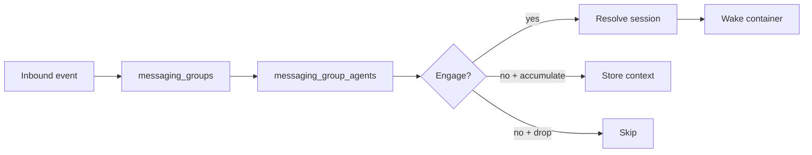
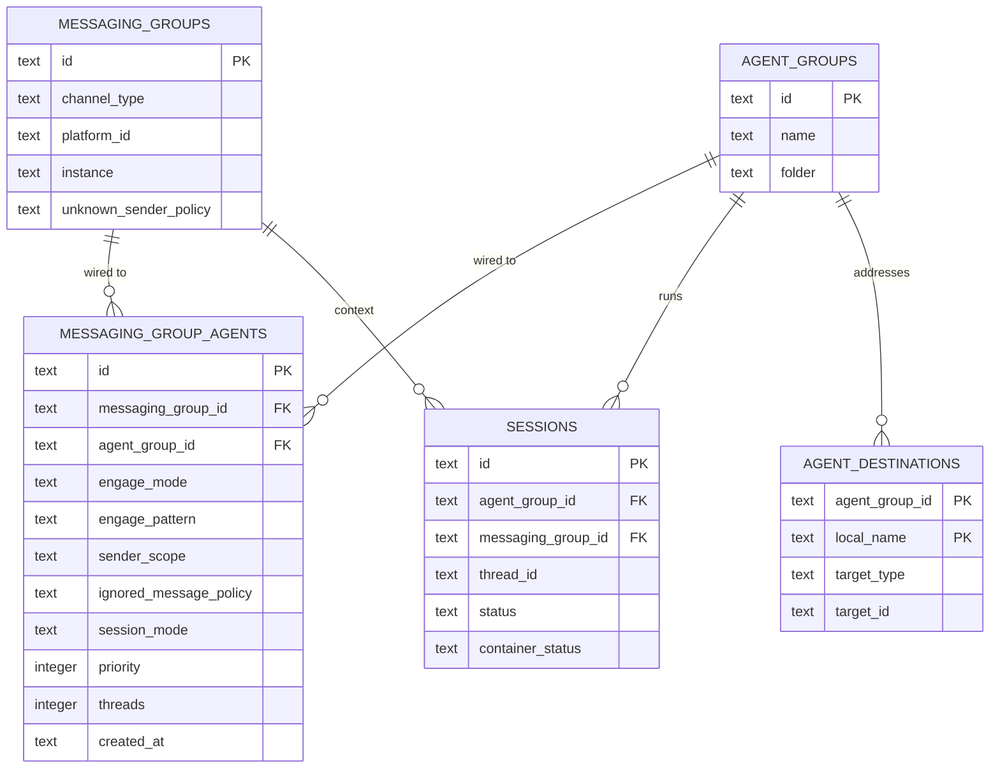
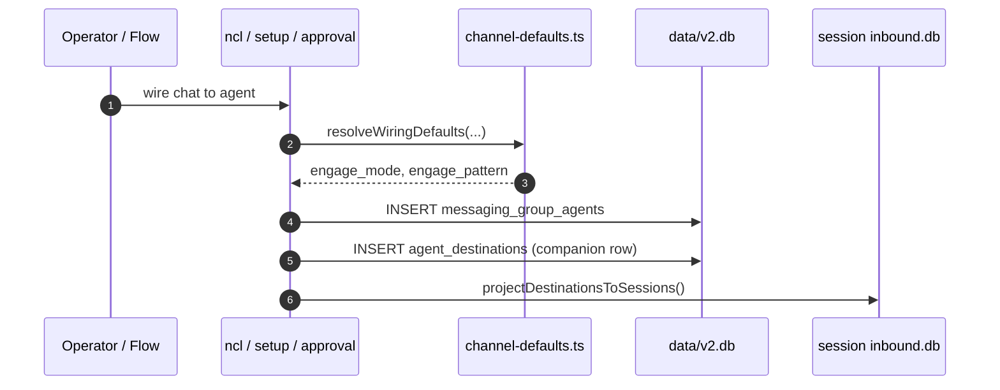
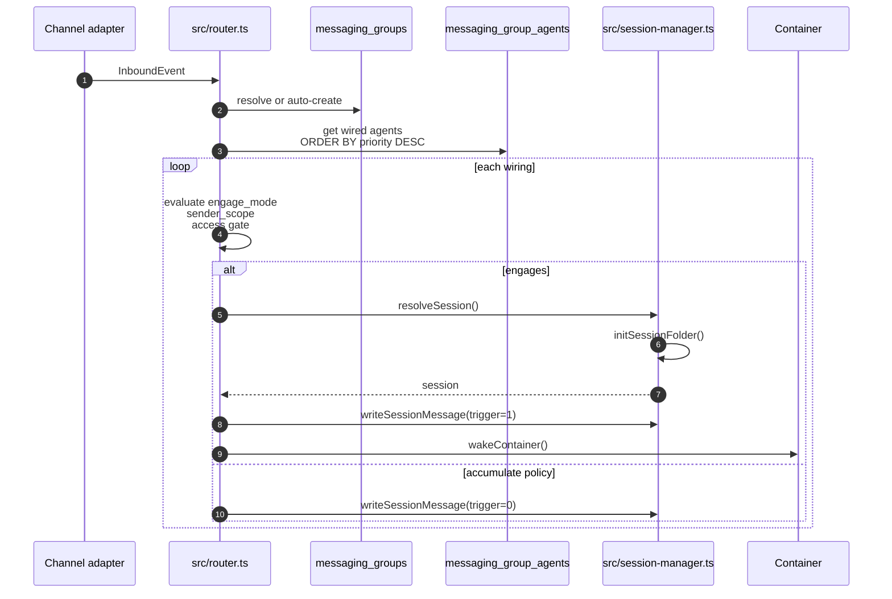

# Messaging Group Agents

A **messaging group agent** wiring connects one messaging group (one chat/channel/DM on one platform) to one agent group. It is the routing-layer contract that decides:

- **Which agent** handles messages from this chat.
- **When** the agent engages (mention, pattern, or mention-sticky).
- **Who** can trigger it (all senders or known senders only).
- **What happens** to non-engaging messages (drop or accumulate as context).
- **Which session** the message runs in (shared, per-thread, or agent-shared).

Multiple wirings can attach to the same messaging group, in which case the router fans out and evaluates each wiring independently. This document describes the wiring entity, its lifecycle, and the routing behavior it drives.

For the platform chat entity being wired, see [docs/messaging-groups.md](messaging-groups.md). For the agent identity that ultimately handles messages, see [docs/agent-groups.md](agent-groups.md).

---

## 1. What a wiring is

Conceptually, a wiring is a **subscription**: "when this chat produces messages matching these rules, deliver them to that agent's session."

The host uses the wiring to answer three questions for every inbound message:

1. **Which agents are subscribed to this chat?** — resolved from `messaging_group_agents` by `messaging_group_id`.
2. **Does this message trigger this agent?** — resolved from `engage_mode`, `engage_pattern`, `sender_scope`, and the access gates.
3. **Which session should it run in?** — resolved from `session_mode`, `threads`, and the adapter capability.



Wirings are many-to-many: one messaging group can fan out to several agents, and one agent group can receive messages from several messaging groups.

---

## 2. Entity model



| Entity | Purpose | Lives in |
| --- | --- | --- |
| `messaging_group_agents` | Channel-to-agent wiring + engagement rules | `data/v2.db` |
| `messaging_groups` | The platform chat being wired | `data/v2.db` |
| `agent_groups` | The agent identity that handles messages | `data/v2.db` |
| `sessions` | Runtime container instance selected by the wiring | `data/v2.db` + `data/v2-sessions/<agent_group_id>/<session_id>/` |
| `agent_destinations` | Named delivery target created as a wiring side effect | `data/v2.db` + projected into session `inbound.db` |

---

## 3. Lifecycle

### 3.1 Creation paths

A wiring can be created in several ways. All paths ultimately insert a row into `messaging_group_agents` and create a companion `agent_destinations` row so the agent can address the chat by name.

| Path | Entry point | Notes |
| --- | --- | --- |
| CLI | `ncl wirings create --channel-type <t> --platform-id <p> --agent-group <folder>` | `src/cli/resources/wirings.ts` |
| Setup wizard | `setup/register.ts` | Used during initial install |
| Channel approval | `src/modules/permissions/channel-approval.ts` | Auto-creates after owner approves a new channel |
| First-agent pairing | `scripts/init-first-agent.ts` | Wires operator DM to the first agent |



The CLI `create` handler is fully custom (not generic CRUD) so it can:

- Resolve the messaging group by `(channel_type, platform_id, instance)`.
- Resolve the agent group by id or folder name.
- Be idempotent on the `(messaging_group_id, agent_group_id)` pair.
- Apply declaration-aware defaults and cross-column validation.
- Normalize `--threads` to `1`/`0` or leave it `NULL` to inherit.
- Project the new destination into any live session so replies work without a restart.

### 3.2 Defaults and validation

Default values for `engage_mode`, `engage_pattern`, and `unknown_sender_policy` come from the channel adapter's declared `ChannelDefaults` (`src/channels/adapter.ts`), resolved by `src/channels/channel-defaults.ts`:

- DM context and group context have separate defaults.
- `{name}` in a declared pattern is replaced with the regex-escaped agent group name.
- `mention-sticky` is downgraded to `mention` when the context's resolved `threads` value is false.

Validation lives in `validateEngageAgainstChannel()`:

- `engage_mode='pattern'` requires a non-empty `engage_pattern`.
- Mention modes are rejected if the adapter declares `mentions: 'never'`.
- `mention-sticky` is coerced to `mention` when threads are off.

### 3.3 Update and delete

| Operation | CLI | Source |
| --- | --- | --- |
| Update engage/session/sender rules | `ncl wirings update --id <id> --engage-mode pattern --engage-pattern '\\bBot\\b'` | `src/cli/resources/wirings.ts` |
| Delete | `ncl wirings delete --id <id>` | `src/cli/resources/wirings.ts` |

Deleting a wiring does **not** delete the messaging group, the agent group, or any existing sessions. The companion `agent_destinations` row is removed by the foreign-key cascade.

---

## 4. Routing and fan-out

For every inbound event, `routeInbound()` in `src/router.ts`:

1. Resolves the `messaging_groups` row (auto-creating on mention/DM if needed).
2. Fetches all `messaging_group_agents` wirings for that messaging group.
3. Resolves the sender via the permissions module's `senderResolver` hook.
4. For each wired agent, evaluates `engage_mode`, `sender_scope`, and the access gate.
5. Resolves or creates a `session` according to the wiring's `session_mode` and thread policy.
6. Writes the message to the session's `inbound.db` and wakes the container.



A single message can fan out to multiple agent groups. Agents are evaluated independently; there is no built-in "winner takes all" logic. `priority` is stored on the wiring and used for ordering (`ORDER BY priority DESC`), but it is currently informational in core routing.

---

## 5. Engage modes

| Mode | Triggers when | Notes |
| --- | --- | --- |
| `pattern` | `engage_pattern` regex matches message text | `'.'` matches every message |
| `mention` | `event.message.isMention` is true | Platform mention/DM signal from adapter |
| `mention-sticky` | Mention OR an active session already exists for `(agent, messaging_group, thread)` | Follow-ups in a thread keep firing without a new mention |

Bad regexes in `pattern` mode fail open so an admin sees the agent respond and can fix the pattern.

`isMention` is a platform-confirmed signal, not a text match. The adapter sets it from the platform's own mention metadata. There is no fallback to the agent group's display name.

---

## 6. Session modes

| Mode | Behavior | Use case |
| --- | --- | --- |
| `shared` | One session per `(agent_group, messaging_group)` | Default; independent conversations per channel |
| `per-thread` | One session per `(agent_group, messaging_group, thread)` | Threaded channels (Discord, Slack, GitHub PRs) |
| `agent-shared` | One session per agent group; ignores messaging group | Cross-channel shared conversation (e.g. GitHub + Slack) |

Resolution is implemented in `src/session-manager.ts:resolveSession()`.

### 6.1 Thread policy override

Threading is the one wiring setting that stays live at runtime (all other engage defaults are snapshotted at creation). `messaging_group_agents.threads` is resolved through `resolveThreadPolicy()` in `src/channels/channel-defaults.ts`:

- `NULL` — inherit the channel adapter's declared default for the context.
- `1`/`0` — explicit override, hard-ANDed with the adapter's raw capability.
- A wiring can opt **out** of threads on a threaded platform, but can never opt **in** on a non-threaded platform.

When threads are enabled for a group chat, the router forces `effectiveSessionMode = 'per-thread'` regardless of the wiring's `session_mode`. `agent-shared` is preserved because it is a cross-channel directive.

---

## 7. Sender scope and ignored messages

- `sender_scope='all'` — any sender can engage the agent, subject only to the messaging group's `unknown_sender_policy`.
- `sender_scope='known'` — only `user_roles` holders or `agent_group_members` rows for this agent group can engage.
- `ignored_message_policy='drop'` — non-engaging messages are silently skipped.
- `ignored_message_policy='accumulate'` — non-engaging messages are still written to the session as silent context (`trigger=0`), unless the access gate or sender-scope gate refused them.

Accumulate is deliberately disabled for refused messages: silently storing content from an untrusted sender (including staging attachments to disk) would defeat the gate.

---

## 8. Companion `agent_destinations` row

Creating a wiring also creates an `agent_destinations` row for the agent group. This gives the agent a local name it can use to address the chat as an explicit delivery target, not just reply to the originating thread.

- The local name uses the messaging group's `name` when set, falling back to `${channel_type}-${mg_id prefix}`.
- A numeric suffix breaks collisions within the agent's namespace.
- The destination is projected into every running session's `inbound.db` `destinations` table so changes take effect without a container restart.
- The row is idempotent: re-wiring is a no-op.

Without this companion row, cross-channel sends (e.g. from an `agent-shared` session) would be dropped by delivery's ACL check.

---

## 9. Database representation

### 9.1 `messaging_group_agents`

```sql
CREATE TABLE messaging_group_agents (
  id                     TEXT PRIMARY KEY,
  messaging_group_id     TEXT NOT NULL REFERENCES messaging_groups(id),
  agent_group_id         TEXT NOT NULL REFERENCES agent_groups(id),
  engage_mode            TEXT NOT NULL DEFAULT 'mention',
                         -- 'pattern' | 'mention' | 'mention-sticky'
  engage_pattern         TEXT,   -- regex; '.' = always
  sender_scope           TEXT NOT NULL DEFAULT 'all',    -- 'all' | 'known'
  ignored_message_policy TEXT NOT NULL DEFAULT 'drop',   -- 'drop' | 'accumulate'
  session_mode           TEXT DEFAULT 'shared',
                         -- 'shared' | 'per-thread' | 'agent-shared'
  priority               INTEGER DEFAULT 0,
  threads                INTEGER, -- NULL = inherit adapter default; 1/0 = override
  created_at             TEXT NOT NULL,
  UNIQUE(messaging_group_id, agent_group_id)
);
```

| Column | Meaning |
| --- | --- |
| `id` | `mga-<uuid>` primary key |
| `messaging_group_id` | The chat being wired; FK to `messaging_groups` |
| `agent_group_id` | The agent that handles messages; FK to `agent_groups` |
| `engage_mode` | `pattern`, `mention`, or `mention-sticky` |
| `engage_pattern` | Regex for pattern mode; `'.'` means match every message |
| `sender_scope` | `all` or `known` |
| `ignored_message_policy` | `drop` or `accumulate` |
| `session_mode` | `shared`, `per-thread`, or `agent-shared` |
| `priority` | Fan-out ordering; currently informational in core routing |
| `threads` | Per-wiring thread override; `NULL` = inherit |
| `created_at` | ISO-8601 UTC timestamp |

Access layer: `src/db/messaging-groups.ts`.

---

## 10. Operations

### 10.1 Inspect wirings

```bash
# List wirings for a messaging group
ncl wirings list

# Get one wiring
ncl wirings get --id <id>

# Raw SQL
pnpm exec tsx scripts/q.ts v2 "SELECT * FROM messaging_group_agents WHERE messaging_group_id = '<id>'"
```

### 10.2 Create and update

```bash
# Wire a chat to an agent by natural keys
ncl wirings create --channel-type telegram --platform-id telegram:123456 --agent-group my-agent

# Wire with explicit rules
ncl wirings create --messaging-group-id <mg-id> --agent-group-id <ag-id> \
  --engage-mode pattern --engage-pattern '\\bops\\b' \
  --session-mode per-thread --sender-scope known

# Update rules
ncl wirings update --id <id> --ignored-message-policy accumulate

# Delete
ncl wirings delete --id <id>
```

### 10.3 Inspect sessions and delivery

```bash
# Sessions for an agent group
pnpm exec tsx scripts/q.ts v2 "SELECT id, messaging_group_id, thread_id, status, container_status, last_active FROM sessions WHERE agent_group_id = '<id>'"

# Did a message reach the container?
pnpm exec tsx scripts/q.ts sessions/<session-id>/inbound "SELECT seq, id, content FROM messages_in ORDER BY seq DESC LIMIT 10"

# Did the agent respond?
pnpm exec tsx scripts/q.ts sessions/<session-id>/outbound "SELECT seq, id, content FROM messages_out ORDER BY seq DESC LIMIT 10"
```

---

## 11. Related docs

- [docs/messaging-groups.md](messaging-groups.md) — the platform chat entity being wired.
- [docs/agent-groups.md](agent-groups.md) — agent identity, container config, sessions, and filesystem layout.
- [docs/isolation-model.md](isolation-model.md) — choosing between shared sessions, same-agent-separate-sessions, and separate agent groups.
- [docs/db-central.md](db-central.md) — full central DB schema.
- [docs/architecture.md](architecture.md) — high-level host/container design and inbound routing.
