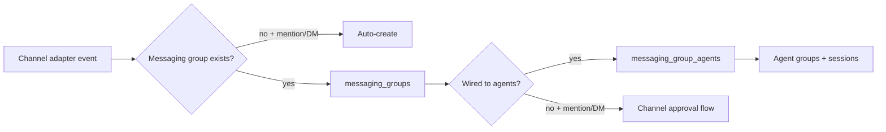
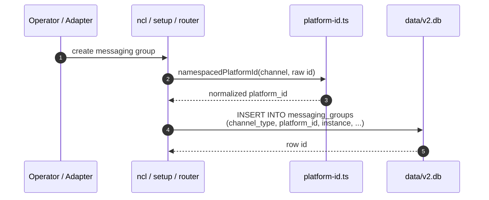

# Messaging Groups

A **messaging group** is one conversation boundary on one platform: a Telegram DM, a WhatsApp group, a Discord channel, a Slack thread root, an email address, a GitHub PR comment stream, etc. It is the channel-side entity that the host routes inbound events to and delivers outbound messages from.

A messaging group does nothing on its own. It becomes meaningful when it is wired to one or more agent groups through `messaging_group_agents`. Those wirings decide which agents handle the chat, when they engage, and how sessions are scoped. This document describes the messaging group entity, its identity, lifecycle, policies, and source files.

For the wiring layer that connects messaging groups to agents, see [docs/messaging-group-agents.md](messaging-group-agents.md). For the agent identity that ultimately handles messages, see [docs/agent-groups.md](agent-groups.md).

---

## 1. What a messaging group is

Conceptually, a messaging group is a **platform-native chat**. If the same human sends the bot a DM on Telegram and a DM on WhatsApp, those are two messaging groups. If the bot is added to two Discord servers, each `#general` channel is its own messaging group.

The host uses the messaging group to answer two questions for every inbound event:

1. **Does this chat exist in NanoClaw yet?** — resolved from `(channel_type, platform_id, instance)`.
2. **What is the access posture for unknown senders?** — resolved from `unknown_sender_policy`.



The entity is intentionally separate from both the **agent identity** (`agent_groups`) and the **runtime instance** (`sessions`). Channels come and go; sessions are created lazily; the messaging group is the persistent address book entry that ties a platform chat to NanoClaw's routing.

---

## 2. Entity model

```mermaid
erDiagram
    MESSAGING_GROUPS {
        text id PK
        text channel_type
        text platform_id
        text instance
        text name
        integer is_group
        text unknown_sender_policy
        text denied_at
        text created_at
    }
    MESSAGING_GROUP_AGENTS {
        text id PK
        text messaging_group_id FK
        text agent_group_id FK
        text engage_mode
        text engage_pattern
        text sender_scope
        text ignored_message_policy
        text session_mode
        integer priority
        integer threads
        text created_at
    }
    SESSIONS {
        text id PK
        text agent_group_id FK
        text messaging_group_id FK
        text thread_id
        text agent_provider
        text status
        text container_status
        text last_active
        text created_at
    }
    PENDING_CHANNEL_APPROVALS {
        text messaging_group_id PK FK
        text agent_group_id
        text original_message
        text approver_user_id
        text created_at
    }
    USER_DMS {
        text user_id PK
        text channel_type PK
        text messaging_group_id FK
        text resolved_at
    }

    MESSAGING_GROUPS ||--o{ MESSAGING_GROUP_AGENTS : "wired to"
    MESSAGING_GROUPS ||--o{ SESSIONS : "context"
    MESSAGING_GROUPS ||--o| PENDING_CHANNEL_APPROVALS : "may await approval"
    MESSAGING_GROUPS ||--o{ USER_DMS : "cached DM"
```

| Entity | Purpose | Lives in |
| --- | --- | --- |
| `messaging_groups` | One platform chat / channel / DM | `data/v2.db` |
| `messaging_group_agents` | Wiring to agent groups + engagement rules | `data/v2.db` |
| `sessions` | Runtime container context for a chat/thread | `data/v2.db` + `data/v2-sessions/<agent_group_id>/<session_id>/` |
| `pending_channel_approvals` | In-flight owner approval for unknown chats | `data/v2.db` |
| `user_dms` | Cached mapping from `(user, channel_type)` to DM group | `data/v2.db` |

---

## 3. Identity

A messaging group is uniquely identified by the triple:

```
(channel_type, platform_id, instance)
```

- **`channel_type`** — the platform key, e.g. `telegram`, `discord`, `slack`, `whatsapp`, `email`. Matches the adapter's `ChannelAdapter.channelType`.
- **`platform_id`** — the platform-native chat identifier. Format varies: Telegram chat id, Discord channel snowflake, phone number, email address, etc.
- **`instance`** — the host-side adapter instance that owns this chat. Defaults to `channel_type`; set to a custom value when running multiple adapters of the same platform (e.g. two Slack apps in one workspace).

The unique constraint on `messaging_groups` is `(channel_type, platform_id, instance)`. This lets sibling instances of the same platform coexist without colliding, while keeping the semantic platform key (`channel_type`) stable for user ids, formatting, and container config.

### 3.1 Platform ID normalization

Adapters do not agree on whether `platform_id` includes a channel-type prefix. Chat SDK adapters (Telegram, Discord, Slack, Teams, etc.) namespace their IDs: `telegram:123456`, `discord:guild:chan`. Native adapters (Signal, WhatsApp, iMessage, DeltaChat) send their native IDs as-is.

`src/platform-id.ts:namespacedPlatformId()` produces the stored form. Any code that writes `messaging_groups` rows must produce the same shape the adapter later emits as `event.platformId`, or router lookups miss and messages get silently dropped.

| Adapter style | Example stored `platform_id` |
| --- | --- |
| Chat SDK | `telegram:123456789` |
| WhatsApp / iMessage | `1234567890@s.whatsapp.net` or `alice@example.com` |
| Signal | `+15551234567` or `group:abc...` |
| DeltaChat | `12` |

### 3.2 Lookup semantics

Lookup paths are deliberately asymmetric:

- **Inbound router** (`getMessagingGroupWithAgentCount`) is **exact-on-instance**. An event from a named instance must not hijack a sibling instance's row. The default parameter (`instance = channelType`) keeps instance-less events resolving the default instance.
- **Outbound / cold-DM / setup** (`getMessagingGroupByPlatform`) is **default-instance-first**. An unset `instance` resolves the default instance, falling back deterministically to the lexically-first named instance. Outbound callers often do not know which adapter instance owns a chat.

---

## 4. Lifecycle

### 4.1 Creation paths

A messaging group can be created in two ways:

| Path | Entry point | Notes |
| --- | --- | --- |
| Explicit | `ncl messaging-groups create --channel-type <t> --platform-id <p> [--instance <i>]` | `src/cli/resources/messaging-groups.ts` |
| Setup wizard | `setup/register.ts` | Used during initial install |
| Auto-create | `src/router.ts:routeInbound()` | Created on @mention or DM when no row exists yet |

All paths ultimately call `createMessagingGroup()` in `src/db/messaging-groups.ts`.



Auto-creation in the router is intentionally conservative:

- Plain chatter in a channel the bot merely sits in does **not** create a row and does not spam the DB.
- Only platform-confirmed mentions (`event.message.isMention === true`) or DMs trigger auto-creation.
- The created row inherits `unknown_sender_policy` and `is_group` from the receiving adapter's declared defaults (or a behavior-faithful fallback for undeclared adapters).

### 4.2 Update and delete

| Operation | CLI | Source |
| --- | --- | --- |
| Update name / policy / group flag | `ncl messaging-groups update --id <id> --name <name> --unknown-sender-policy public` | `src/db/messaging-groups.ts` |
| Deny / un-deny | set/clear `denied_at` via admin flow | `src/db/messaging-groups.ts:setMessagingGroupDeniedAt()` |
| Delete | `ncl messaging-groups delete --id <id>` | `src/cli/resources/messaging-groups.ts` |

Deleting a messaging group is only safe when no wirings reference it. The CLI generic CRUD layer enforces foreign-key behavior through the schema; if children exist, the delete fails until the operator removes the wirings.

---

## 5. Unknown sender policy and channel approval

`unknown_sender_policy` governs what happens when a sender the host has never seen posts in this chat. It is a per-chat setting, not a per-agent setting.

| Policy | Behavior |
| --- | --- |
| `strict` | Silently drop messages from unrecognized senders. |
| `request_approval` | Escalate an approval card to the owner. Approved → wiring created, event replayed. Denied → `denied_at` set, future mentions silently dropped. |
| `public` | Allow anyone to engage. |

The policy is evaluated by the permissions module's `accessGate` hook (registered from `src/modules/permissions/index.ts`). Without the permissions module, core defaults to allow-all.

### 5.1 Channel registration flow

When a chat has no wirings (`agentCount === 0`) and receives a mention/DM:

1. The router records a `dropped_messages` row with reason `no_agent_wired`.
2. If a `channelRequestGate` hook is registered, it fires and escalates to the owner.
3. The hook persists a `pending_channel_approvals` row (PK on `messaging_group_id` for in-flight dedup).
4. Owner approves → a `messaging_group_agents` wiring is created, `denied_at` is cleared, and the original event is replayed through `routeInbound()`.
5. Owner denies → `messaging_groups.denied_at` is set. Future messages drop silently without re-escalating.

Explicitly wiring the chat (via `ncl wirings create`, setup wizard, etc.) implicitly clears the denied state by making `agentCount > 0`.

---

## 6. Database representation

### 6.1 `messaging_groups`

```sql
CREATE TABLE messaging_groups (
  id                    TEXT PRIMARY KEY,
  channel_type          TEXT NOT NULL,
  platform_id           TEXT NOT NULL,
  instance              TEXT NOT NULL,
  name                  TEXT,
  is_group              INTEGER DEFAULT 0,
  unknown_sender_policy TEXT NOT NULL DEFAULT 'strict',
                        -- 'strict' | 'request_approval' | 'public'
  created_at            TEXT NOT NULL,
  denied_at             TEXT,
  UNIQUE(channel_type, platform_id, instance)
);
```

| Column | Meaning |
| --- | --- |
| `id` | `mg-<uuid>` primary key |
| `channel_type` | Platform key; matches the adapter's `channelType` |
| `platform_id` | Platform-native chat identifier, normalized per `src/platform-id.ts` |
| `instance` | Adapter instance that owns this chat; defaults to `channel_type` |
| `name` | Display name; often auto-populated by the adapter |
| `is_group` | `1` for multi-user chats, `0` for DMs; affects session scoping |
| `unknown_sender_policy` | `strict`, `request_approval`, or `public` |
| `denied_at` | Timestamp if owner denied the channel; future messages drop silently |
| `created_at` | ISO-8601 UTC timestamp |

Access layer: `src/db/messaging-groups.ts`.

---

## 7. Channel adapters and the registry

Messaging groups are bound to live adapters through the channel registry in `src/channels/channel-registry.ts`:

- Adapters self-register at import time via `registerChannelAdapter(name, registration)`.
- `initChannelAdapters()` instantiates and sets up each registered adapter at host startup.
- Active adapters are keyed by `instance ?? channelType`.
- `getChannelAdapter(key)` resolves by exact instance key, falling back to any adapter of the same `channelType` for legacy callers.
- `getChannelAdapterExact(key)` is used for outbound delivery and typing so messages never leak through the wrong bot identity.

Each adapter declares `ChannelDefaults` (`src/channels/adapter.ts`) that snapshot at wiring/messaging-group creation time:

| Context default | Used for |
| --- | --- |
| `engageMode` / `engagePattern` | Default `messaging_group_agents.engage_mode` and `engage_pattern` |
| `threads` | Default per-thread behavior for the chat context |
| `unknownSenderPolicy` | Default `messaging_groups.unknown_sender_policy` |
| `mentions` | Validation: whether the adapter ever emits `isMention` |

Declared defaults are consumed by `src/channels/channel-defaults.ts`. Undeclared adapters fall back to behavior-faithful defaults in `fallbackChannelDefaults()`.

---

## 8. Operations

### 8.1 Inspect messaging groups

```bash
# List all messaging groups
ncl messaging-groups list

# Get one group
ncl messaging-groups get --id <id>

# Raw SQL
pnpm exec tsx scripts/q.ts v2 "SELECT id, channel_type, platform_id, instance, name, is_group, unknown_sender_policy, denied_at FROM messaging_groups"
```

### 8.2 Create and update

```bash
# Create a messaging group explicitly
ncl messaging-groups create --channel-type telegram --platform-id telegram:123456 --name "Ops Channel"

# Update policy
ncl messaging-groups update --id <id> --unknown-sender-policy public

# Delete (fails if wirings still reference it)
ncl messaging-groups delete --id <id>
```

### 8.3 Send a synthetic inbound message

```bash
# Wake the wired agent with a message as if it came from the chat
ncl messaging-groups send --channel-type telegram --platform-id telegram:123456 --text "hello"
```

### 8.4 Inspect approvals

```bash
# Pending channel approvals (table added by migration 012)
pnpm exec tsx scripts/q.ts v2 "SELECT * FROM pending_channel_approvals"

# Dropped messages audit
pnpm exec tsx scripts/q.ts v2 "SELECT * FROM dropped_messages WHERE messaging_group_id = '<id>' ORDER BY created_at DESC LIMIT 10"
```

---

## 9. Related docs

- [docs/messaging-group-agents.md](messaging-group-agents.md) — wiring chats to agents, engagement rules, and routing.
- [docs/agent-groups.md](agent-groups.md) — agent identity, container config, sessions, and filesystem layout.
- [docs/isolation-model.md](isolation-model.md) — choosing between shared sessions, same-agent-separate-sessions, and separate agent groups.
- [docs/db-central.md](db-central.md) — full central DB schema.
- [docs/setup-wiring.md](setup-wiring.md) — entity model and message flow.
